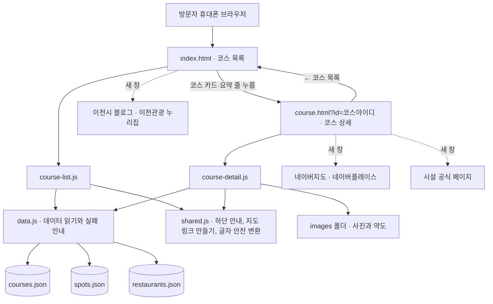

# 이천 아이맵 기술 요구사항 문서

상태: 작성 중 (다음: 현장 사진 반영 기능 사용자 확인)

> 2026-09-20 추가 요청: 기존 정적 사이트는 그대로 공개하며, 사진 반영 때만 로컬 미리보기 서버(`tools/serve.mjs`)가 JPEG 파일과 `data/published-photos.json`을 저장하고 해당 파일만 GitHub에 올린다. 공개 페이지의 편집 표시는 미리보기 용도이며 저장은 로컬 서버에서만 가능하다.

> 2026-09-18 작성. 진행 모드는 간단이다. `docs/prd.md`와 `docs/frd.md`(둘 다 완료)를 입력으로 받았다. 학습자가 "다 추천으로"를 선택해 스택은 A안으로, 나머지 설계는 모두 추천안으로 확정했다.

## 이 문서가 이어받은 것

`docs/frd.md` ⑤절이 4단계로 넘긴 결정 4가지에 모두 답했다.

| 넘어온 숙제 | 이 문서의 답 | 위치 |
|---|---|---|
| 코스별 고유 주소를 만드는 방식 | `course.html?id=코스아이디` | ② |
| 데이터 파일을 화면에 불러오는 방식 | 데이터 파일 3개를 화면이 읽어 오고, 실패하면 안내 문구를 띄운다 | ② |
| 배포 위치와 방법 | GitHub Pages. 맨 마지막 선택 단계 | ⑤ |
| 데이터 문법 검사 | `tools/check-data.mjs`를 올리기 전에 한 번 돌린다 | ⑤ |

## 이 서비스의 기술 조건 (FRD에서 확정된 사실)

- 사용자가 값을 입력하는 칸이 없다. 로그인·회원가입·결제가 없다.
- 서버에서 처리할 일이 없다. 모든 내용이 데이터 파일에서 화면으로 간다.
- 권한 등급이 없다. 모든 방문자가 같은 화면을 본다.
- 저장하는 사용자 데이터가 없다. 취향 필터와 카드 펼침 상태는 화면에서만 동작하고 저장하지 않는다.
- 화면은 2개(코스 목록, 코스 상세)와 두 화면 공통 하단 안내다.
- 외부 연동은 링크로 새 창을 여는 것뿐이다. 네이버지도 검색, 시설 공식 페이지, 네이버플레이스, 이천시 블로그, 이천관광 누리집. **어느 것도 키 발급이나 가입이 필요 없다.**
- 네이버지도 임베드는 제외 확정이라 API 키가 필요 없다.

이 조건 때문에 백엔드(뒤에서 일하는 주방)와 데이터베이스(창고 장부)가 필요 없다. 기술 선택이 정적 사이트 범위로 좁혀진다.

## ① 선택한 스택과 이유

### 확정: 순수 HTML + CSS + 자바스크립트 (빌드 도구 없음)

웹 서비스는 보통 **프론트엔드**(사용자가 보는 화면, 가게의 홀), **백엔드**(뒤에서 일하는 주방), **데이터베이스**(창고 장부) 셋으로 나뉜다. 이천 아이맵은 사용자가 읽기만 하므로 주방과 창고 장부가 없고 홀만 있다.

- **HTML** — 화면의 뼈대. 제목, 카드, 버튼이 어디에 있는지 적는 부분이다.
- **CSS** — 화면의 옷. 색, 글자 크기, 간격을 적는 부분이다. `docs/design-prompt.md` 5절의 값이 여기 들어간다.
- **자바스크립트** — 화면의 손발. 데이터 파일을 읽어 카드를 그리고, 칩을 누르면 거르고, 카드를 펼친다.

**고른 이유**: 화면이 2개뿐이고 서버가 없다. 중간 도구를 얹으면 얻는 편의보다 배우고 고칠 것이 늘어난다. 브라우저가 바로 이해하는 언어라 AI가 고칠 때도 파일 하나만 보면 되고, 비개발자가 데이터 파일을 직접 열어 글자를 고칠 수 있다.

**나중에 바꾸려면: 쉬움.** 화면 코드와 데이터가 분리되어 있어 데이터 파일 3개를 그대로 들고 다른 조합으로 옮길 수 있다.

### 비교했던 대안

| | 선택 A. 순수 HTML·CSS·JS | B. Vite + 순수 JS | C. Next.js (React) |
|---|---|---|---|
| 미리 설치할 것 | 없음. 미리보기 명령 한 줄만 | 부품 꾸러미 약 20개 | 부품 꾸러미 수백 개 |
| 만들 파일 | HTML 2, CSS 1, JS 4, 데이터 3 | 위와 같음 + 설정 2 | 페이지·부품 10개 이상 + 설정 |
| 배우기 난이도 | 낮음 | 보통 | 높음 |
| 월 비용 | 0원 | 0원 | 0원 |
| 나중에 바꾸려면 | 쉬움 | 쉬움 | 어려움 |

- **B. Vite** — 저장하면 화면이 즉시 바뀌는 개발 도우미다. 화면이 수십 개로 늘 때 값어치가 나오며, 2개에서는 차이가 작고 인터넷에 올릴 때 "빌드"라는 변환 단계가 하나 더 생긴다.
- **C. Next.js (React)** — 큰 서비스에서 가장 많이 쓴다. 코스마다 파일을 따로 두어 주소가 깔끔해지지만 배우고 관리할 개념이 크게 는다. 화면 2개짜리에 공장 설비를 들이는 셈이다.
- 검토했지만 후보에서 뺀 것: **Supabase** 같은 데이터베이스 서비스(저장할 사용자 데이터가 없다), **Astro** 같은 정적 사이트 도구(화면이 2개뿐이라 값어치가 작다).

### 코스별 고유 주소 방식 (확정)

`course.html?id=seolbong-story` 형태를 쓴다. `?id=` 뒤의 글자가 어느 코스인지 가리킨다.

- 코스 목록의 카드나 요약 줄을 누르면 이 주소로 이동한다.
- 주소를 복사해 다른 기기에서 열면 같은 코스가 나온다. FRD 인수 기준 6번이 이것으로 충족된다.
- `?id=` 값이 데이터에 없는 코스면 `index.html`로 보낸다. FRD 인수 기준 8번.

**나중에 바꾸려면: 배포 전에는 쉬움, 배포 후에는 어려움.** 주소를 이미 공유한 뒤에 바꾸면 그 링크가 깨진다.

검토한 대안: 주소 뒤에 `#`을 붙이는 방식(프로토타입이 쓰던 방식)과 코스마다 폴더를 만드는 방식. 앞은 주소가 덜 읽히고, 뒤는 같은 코드를 6번 복사하게 되어 뺐다.

### 데이터 파일을 읽는 방식 (확정)

화면이 열릴 때 자바스크립트가 `data/` 폴더의 파일 3개를 읽어 온다.

주의할 점이 하나 있다. 이 방식은 **파일을 더블클릭해서 여는 것으로는 동작하지 않고 미리보기 서버로 열어야 한다.** 브라우저의 보안 규칙 때문이다. 그래서 읽기에 실패하면 빈 화면 대신 "이 페이지는 미리보기 서버로 열어야 합니다"라는 안내와 여는 방법을 화면에 띄운다. 실행 방법은 ⑤절에 있다.

검토한 대안: 데이터를 자바스크립트 파일로 만들면 더블클릭으로도 열리지만, 표준 데이터 형식이 아니라 문법 검사 도구를 그대로 쓸 수 없고 깃허브에 올렸을 때 이점도 없어 뺐다.

## ② 시스템 구조



서버도, 로그인도, 데이터베이스도 없다. 브라우저가 파일을 읽어 화면을 그리는 것이 전부다.

## ③ 데이터 모델

데이터 파일은 엑셀 파일 하나에 시트를 여러 장 둔 것과 같다. 시트 이름이 파일 이름이고, 열 이름이 항목 이름이다. 다만 주차장·시설·팁처럼 한 스팟에 여러 줄이 딸리는 것은 별도 시트가 아니라 스팟 줄 안에 목록으로 넣는다.

### 파일 1. `data/courses.json` — 코스 시트 + 페이지 공통 값

맨 위에 페이지 공통 값을 두고 그 아래 코스 5줄을 둔다. **기준일이 여기 한 곳에만 있다** (FRD `F6.2`).

공통 값

| 항목 | 뜻 | 예시 |
|---|---|---|
| `asOf` | 운영 정보 기준일. 하단 안내에 그대로 나온다 | `2026-09-04` |
| `regions` | 권역 이름 3개 | `["도심·설봉권", "남부·모가권", "서이천·마장권"]` |
| `links` | 바깥 링크 타일 2개의 이름·설명·주소 | 이천시 공식 블로그 / 이천관광 누리집 |

코스 한 줄

| 열 이름 | 뜻 | 예시 |
|---|---|---|
| `id` | 주소에 쓰는 코스 구분값. 영문 소문자와 붙임표만 | `seolbong-story` |
| `name` | 코스 이름 | 설봉공원 이야기·문화 코스 |
| `region` | 권역 | 도심·설봉권 |
| `track` | 취향 트랙. `make` / `out` / `story` 셋 중 하나 | `story` |
| `rain` | 비 오는 날 OK 여부 | `true` |
| `listLine` | 코스 카드의 한 줄 요약 | 설봉공원 · 위쪽 주차장 → 시립박물관·월전미술관·도자미술관 |
| `intro` | 코스 상세의 소개 한 줄 | 위쪽 주차장에 대고 실내 전시를 도는 코스 |
| `spots` | 이 코스가 가는 스팟 목록. 스팟마다 `id`, `parking`(추천 주차장 한 줄), `going`(이 코스에서 가는 곳) | 아래 참고 |
| `foodSearch` | 근처 식당 네이버지도 검색어 | 이천 설봉공원 근처 식당 |

### 파일 2. `data/spots.json` — 스팟 시트

스팟 한 줄

| 열 이름 | 뜻 | 예시 |
|---|---|---|
| `id` | 스팟 구분값 | `seolbong` |
| `name` | 스팟 이름 | 설봉공원 |
| `photo` | 대표 사진. 파일명·대체텍스트·출처·저작자·라이선스·촬영일 | 아래 사진 항목 참고 |
| `parkings` | 주차장 목록 | 아래 참고 |
| `facilities` | 시설 목록 | 아래 참고 |
| `tips` | 방문 팁 문장 목록. 앞에 `주차:` `진입:` `아이:` `운영:` `식사:`를 붙이면 태그가 된다 | `["진입: 공원 안 도로는 일방통행이다"]` |
| `sketch` | 방문자 시점 약도. 파일명과 설명 캡션. 없으면 비운다 | 비어 있으면 탭이 숨는다 |
| `checkedOn` | 확인일. 화면에 안 나오고 내부에만 남는다 | `2026-09-04` |
| `checkedBy` | 확인 방법. `직접 답사` 또는 `웹 조사` | 직접 답사 |

주차장 한 줄

| 열 이름 | 뜻 | 예시 |
|---|---|---|
| `name` | 주차장 이름 | 위쪽 주차장 |
| `walkTo` | 걸어서 갈 수 있는 시설 | 시립박물관·월전미술관·도자미술관 |
| `entry` | 진입 방향 메모 | 공원 안 도로는 일방통행 |
| `mapQuery` | 네이버지도 검색어. 이 글자로 링크가 자동으로 만들어진다 | 이천 설봉공원 주차장 |
| `mapBased` | 답사 없이 지도로 채웠는지. `true`면 "지도 기준" 배지가 붙는다 | `false` |
| `thumb` | 줄 왼쪽 썸네일 사진. 없으면 비운다 | |

시설 한 줄

| 열 이름 | 뜻 | 예시 |
|---|---|---|
| `name` | 시설 이름 | 이천시립박물관 |
| `hours` | 운영시간·정기휴무·전화를 한 줄로 | 10:00~18:00 · 월요일 휴관 · 문의 031-633-9734 |
| `official` | 공식 페이지 주소. 있으면 "공식 페이지" 버튼이 나온다 | |
| `mapQuery` | 지도 검색어. 공식 페이지가 없고 이 값이 있으면 "지도 열기" 버튼이 나온다 | 설봉공원 놀이터 |
| `thumb` | 줄 왼쪽 썸네일 사진. 없으면 비운다 | |

`official`과 `mapQuery`가 둘 다 비면 버튼 없이 이름과 한 줄 소개만 나온다. FRD의 "호수 산책" 규칙이 이것이다.

사진 항목 (대표 사진·썸네일·약도 공통)

| 열 이름 | 뜻 | 예시 |
|---|---|---|
| `file` | 파일 이름 | `seolbong-lake.jpg` |
| `alt` | 대체텍스트. 사진이 안 뜰 때 읽히는 글 | 설봉호와 산책로 |
| `credit` | 화면에 겹쳐 쓰는 출처 한 줄 | 설봉호 · Wikimedia Commons |
| `license` | 라이선스 이름. 직접 찍었으면 비운다 | CC BY-SA 4.0 |
| `takenOn` | 촬영일. 직접 찍은 사진에만 | `2026-09-04` |

### 파일 3. `data/restaurants.json` — 식당 시트

| 열 이름 | 뜻 | 예시 |
|---|---|---|
| `courseId` | 어느 코스의 부록인지 | `seolbong-story` |
| `list` | 추천 식당 목록. 식당마다 `name`, `tip`, `mapQuery`. 비어 있으면 추천 식당 구역이 통째로 숨는다 | 푸주옥 / 아이와 함께 따끈한 설렁탕 한 그릇 |

**영업시간·휴무·메뉴·가격은 어느 파일에도 두지 않는다.** 네이버플레이스 링크로 넘긴다.

### 시드 데이터 (개발 중 미리 채워 넣는 연습용 예시 데이터)

PRD의 데이터 사용 원칙을 그대로 따른다. **답사하거나 공식 자료로 확인하지 않은 값을 그럴듯하게 지어내지 않는다.**

- 구조를 먼저 채우고 아직 모르는 값은 `[운영시간 확인 후 기입]`처럼 대괄호 표시를 남긴다. `design/old/05-프로토타입.html`의 데이터가 이미 이 형태이며 그대로 옮겨 쓴다.
- 대괄호 표시가 남아 있으면 `tools/check-data.mjs`가 경고한다. 인터넷에 올리기 전에 모두 채우거나, 채울 수 없으면 그 줄을 통째로 뺀다.
- 프로토타입의 "정문 주차장 / 후문 주차장"은 옛 이름이다. "안내센터 옆 주차장"으로 바꾸고, 두 번째 주차장 이름이 확인되지 않으면 그 줄을 뺀다.

### 권한

권한 등급이 없다. 모든 방문자가 같은 화면을 본다. 관리자 화면도 없고, 내용 수정은 운영자가 파일을 고쳐 다시 올리는 방식이다.

### 표준 적용 항목의 구체 방식

FRD ⑦절이 넘긴 항목을 여기서 방식까지 정한다. 학습자가 고를 것은 없고 모두 표준안이다.

| 항목 | 구체 방식 | 왜 |
|---|---|---|
| 바깥 링크 | `target="_blank"`와 `rel="noopener noreferrer"`를 함께 붙인다 | 새로 열린 페이지가 원래 페이지를 조작하지 못하게 막는다 |
| 대체텍스트 | 모든 사진에 `alt`를 넣고, 비어 있으면 검사 도구가 경고한다 | 사진이 안 뜨거나 화면을 소리로 읽어 줄 때 필요하다 |
| 특수문자 안전 변환 | 데이터의 글자를 화면에 넣을 때 `textContent`를 쓰거나 변환 함수를 거친다 | 따옴표나 꺾쇠가 화면 구조를 깨뜨리지 않게 한다 |
| 누르는 영역 | CSS에서 최소 높이 44px을 준다 | 아이를 안고 한 손으로 쓸 때 잘못 눌리지 않게 한다 |
| 글꼴 | Pretendard를 먼저 쓰고 없으면 시스템 고딕으로 내려간다 | 글꼴 파일을 못 받아도 글자가 깨지지 않는다 |

## ④ 폴더 구조

기능별로 폴더를 나누되 프로젝트 하나 안에 둔다. 부서별로 나누되 한 건물 안에 두는 구조다.

```
ICHEON_claude/
├─ index.html                 코스 목록 화면
├─ course.html                코스 상세 화면
├─ assets/
│  ├─ css/
│  │  └─ style.css            디자인 시스템 값과 두 화면의 모든 스타일
│  └─ js/
│     ├─ data.js              데이터 3개 읽기 + 실패 시 안내
│     ├─ shared.js            하단 안내, 지도 링크 만들기, 글자 안전 변환
│     ├─ course-list.js       코스 목록 화면 (F1)
│     └─ course-detail.js     코스 상세 화면 (F2·F3·F4)
├─ data/
│  ├─ courses.json            코스 5개 + 기준일 + 바깥 링크 2개
│  ├─ spots.json              스팟 5곳 + 주차장 + 시설 + 팁 + 약도
│  └─ restaurants.json        코스별 식당 부록
├─ images/
│  ├─ spots/                  스팟 대표 사진 (5장)
│  ├─ thumbs/                 주차장·시설 썸네일 (15장 안팎)
│  └─ maps/                   방문자 시점 약도
├─ tools/
│  ├─ serve.mjs               로컬 미리보기 서버
│  └─ check-data.mjs          데이터 문법·필수 항목 검사
├─ docs/                      기존 문서 (PRD, 디자인, FRD, TRD, 계획)
└─ design/                    확정 시안 PNG 3장과 참고 자료
```

화면별로 자바스크립트 파일이 나뉘어 있어, 코스 목록을 고칠 때 `course-list.js` 하나만 열면 된다.

## ⑤ 실행과 배포 방법

### 1차 완료 기준: 내 컴퓨터에서 열린다

**localhost**는 내 컴퓨터 안에서만 열리는 연습용 주소다. 인터넷에 올린 것이 아니라 나만 볼 수 있다.

`tools/serve.mjs`를 프로젝트 안에 두고 아래 한 줄로 켠다. Node 24가 이미 설치되어 있으므로 따로 설치할 것이 없다.

```bash
node tools/serve.mjs
```

켜지면 브라우저에서 `http://localhost:8765`를 연다. 파일을 고치고 새로고침하면 바뀐 화면이 보인다.

지금 있는 미리보기 설정 `.claude/launch.json`은 지난 작업의 임시 폴더를 가리키고 있어 그대로는 동작하지 않는다. 서버 파일을 프로젝트 안 `tools/`로 옮기면 새 대화에서도 그대로 쓸 수 있다. `.claude/` 폴더는 깃허브에 올리지 않으므로 설정도 함께 고친다.

### 올리기 전 검사

```bash
node tools/check-data.mjs
```

이 검사가 확인하는 것:

- 데이터 파일 3개의 문법. 쉼표 하나가 빠져 화면이 통째로 안 나오는 사고를 미리 잡는다.
- 모든 주차장에 지도 검색어가 있는지 (FRD 인수 기준 12번)
- 공식 페이지가 있다고 적은 시설의 주소가 비어 있지 않은지 (13번)
- 모든 사진에 대체텍스트가 있는지
- `[확인 후 기입]` 같은 대괄호 표시가 남아 있는지
- 코스가 가리키는 스팟이 실제로 `spots.json`에 있는지

### 배포: 맨 마지막 선택 단계

지금 하지 않아도 된다. 5단계 개발 계획에서 선택 항목으로 둔다.

올릴 곳은 **GitHub Pages**다. 이미 쓰고 있는 저장소 `hayoungmom23-a12/ICHEON-3-CLAUDE`가 공개라 새로 가입할 곳이 없다. 저장소 설정의 Pages 항목에서 브랜치를 `main`, 폴더를 루트로 고르면 몇 분 뒤 주소가 생긴다. 만든 파일을 그대로 올리는 방식이라 변환 단계가 없다. 주소는 `https://hayoungmom23-a12.github.io/ICHEON-3-CLAUDE/` 형태가 된다.

검토한 대안: Vercel과 Netlify도 무료로 쓸 수 있지만 계정을 새로 만들어야 하고, 정적 파일만 올리는 이 프로젝트에서는 GitHub Pages와 결과가 같아 뺐다.

## ⑥ 월 비용 추정

| 항목 | 비용 | 한도와 유료 전환 시점 |
|---|---|---|
| 개발 도구 | 0원 | Node는 무료다. 설치할 유료 부품이 없다 |
| 데이터 저장 | 0원 | 데이터베이스 서비스를 쓰지 않는다 |
| 지도·외부 서비스 | 0원 | 링크로 새 창을 여는 것뿐이라 키도 요금도 없다 |
| GitHub Pages (배포할 경우) | 0원 | 공개 저장소는 무료. 저장 1GB, 월 전송 100GB까지 |
| **합계** | **월 0원** | |

**유료로 바뀌는 시점**: 사실상 없다. 사진 20장에 페이지가 가벼워 방문 한 번에 2MB를 쓴다고 보면 월 100GB는 방문 5만 회 수준이다. 가족 단위로 쓰는 이 서비스에서는 한도 근처에도 가지 않는다. 혹시 넘기더라도 정적 파일이라 다른 무료 서비스로 옮기기 쉽다.

## ⑦ 바꾸기 어려운 결정 목록

| 결정 | 나중에 바꾸려면 | 왜 |
|---|---|---|
| 코스 주소 형태 `course.html?id=...` | **배포 전 쉬움 / 배포 후 어려움** | 주소를 이미 공유한 뒤에 바꾸면 그 링크가 깨진다. 배포 전에 정해 두는 것이 중요하다 |
| 데이터 파일 3개의 항목 이름 | 보통 | 항목 이름을 바꾸면 화면 코드에서 그 이름을 쓰는 곳을 모두 고쳐야 한다. 지금 정한 이름은 프로토타입에서 이미 써 본 것이다 |
| 사진 폴더 규칙 (`spots` / `thumbs` / `maps`) | 쉬움 | 폴더 이름만 바꾸고 데이터의 파일명을 함께 고치면 된다 |
| 스택 (순수 HTML·CSS·JS) | 쉬움 | 화면 코드와 데이터가 분리되어 있어 데이터 파일 3개를 그대로 들고 옮길 수 있다 |
| 배포 위치 (GitHub Pages) | 쉬움 | 정적 파일이라 다른 곳에 올려도 그대로 동작한다. 주소만 바뀐다 |

## 셀프 체크

- FRD의 모든 핵심 기능이 이 스택으로 구현 가능한가 — 가능하다. 필수 37개 중 서버가 필요한 것이 하나도 없다. 취향 필터, 카드 펼치기, 탭 전환, 개수 계산은 모두 브라우저 안에서 끝난다.
- 고난이도 설계가 섞여 있지 않은가 — 없다. 서비스를 여러 동으로 쪼개는 구조, 컨테이너 운영, 이벤트 기반 설계를 쓰지 않는다. 폴더만 기능별로 나눈 한 프로젝트다.
- 비용 추정이 빠진 결정이 없는가 — 모든 항목이 0원이고 유료 전환 조건까지 ⑥절에 적었다.
